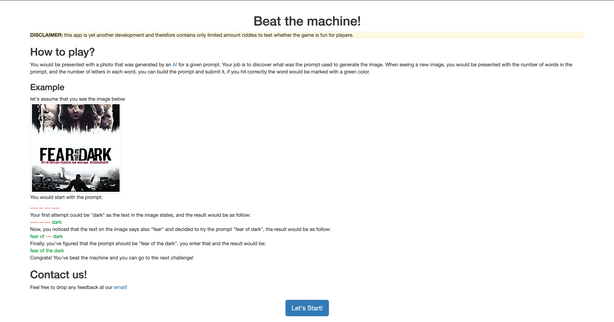

# Beat The Machine!

[ci-badge]: https://github.com/yonatankarp/beat-the-machine/actions/workflows/ci.yml/badge.svg
[ci-state]: https://github.com/yonatankarp/beat-the-machine/actions/workflows/ci.yml
[linter-badge]: https://github.com/yonatankarp/beat-the-machine/actions/workflows/linting.yml/badge.svg
[linter-state]: https://github.com/yonatankarp/beat-the-machine/actions/workflows/linting.yml
[quality-badge]: https://sonarcloud.io/api/project_badges/measure?project=yonatankarp_beat-the-machine&metric=alert_status
[quality-state]: https://sonarcloud.io/summary/new_code?id=yonatankarp_beat-the-machine
[maintainability-badge]: https://sonarcloud.io/api/project_badges/measure?project=yonatankarp_beat-the-machine&metric=sqale_rating
[maintainability-state]: https://sonarcloud.io/summary/new_code?id=yonatankarp_beat-the-machine
[tech-debt-badge]: https://sonarcloud.io/api/project_badges/measure?project=yonatankarp_beat-the-machine&metric=sqale_index
[tech-debt-state]: https://sonarcloud.io/summary/new_code?id=yonatankarp_beat-the-machine
[security-badge]: https://sonarcloud.io/api/project_badges/measure?project=yonatankarp_beat-the-machine&metric=security_rating
[security-state]: https://sonarcloud.io/summary/new_code?id=yonatankarp_beat-the-machine
[vulnerabilities-badge]: https://sonarcloud.io/api/project_badges/measure?project=yonatankarp_beat-the-machine&metric=vulnerabilities
[vulnerabilities-state]: https://sonarcloud.io/summary/new_code?id=yonatankarp_beat-the-machine

| **Type**     | **Status**                                                                                                                                                                             |
|--------------|----------------------------------------------------------------------------------------------------------------------------------------------------------------------------------------|
| CI pipelines | [![Build][ci-badge]][ci-state]  [![Build][linter-badge]][linter-state]                                                                                                                 |
| Maintenance  | [![Quality Gate Status][quality-badge]][quality-state] [![Maintainability Rating][maintainability-badge]][maintainability-state] [![Technical Debt][tech-debt-badge]][tech-debt-state] |
| Security     | [![Security Rating][security-badge]][security-state] [![Vulnerabilities][vulnerabilities-badge]][vulnerabilities-state]                                                                |

This repository manages the entire [Beat the machine!](https://beat-the-machine.yonatankarp.com/)
game, which allow you to play the "Hangman Challenge" for auto AI auto-generated
images.

To play the game locally on your machine, you can download the latest
[release](https://github.com/yonatankarp/beat-the-machine/releases) jar file
and run it using the command:

```shell
java -jar beat-the-machine-0.1.0.jar
```

Go to your browser and enter the following url:

```text
https://localhost
```



## Getting Started

These instructions will get you a copy of the project up and running on your
local machine for development and testing purposes. See deployment for notes on
how to deploy the project on a live system.

### Prerequisites

To run the project you need to install the following:

- JDK 17 or newer

### Building the application

The project uses [Gradle](https://gradle.org) as a build tool. It already contains
`./gradlew` wrapper script, so there's no need to install gradle.

To build the project execute the following command:

```shell
  ./gradlew build
```

### Running the application

You can run this project directly from Gradle by executing the following
command:

```shell
./gradlew bootRun
```

This will start the API container exposing the application's port
(set to `80` in this app).

In order to test if the application is up, you can call its health endpoint:

```shell
  curl http://localhost:80/health
```

You should get a response similar to this:

```json
  {"status":"UP"}
```

### And coding style tests

This project uses [Spotless Gradle plugin](https://github.com/diffplug/spotless)
to enforce its code style. The plugin will run automatically after every
successful build, test, and assemble stage. However, if you would like to run
it manually you can do so by running the following commands:

To apply the code style to the project run:

```shell
./gradlew spotlessApply
```

To check your code without applying any changes you can execute:

```shell
./gradlew spotlessCheck
```

## Built With

- [OpenJdk 17](https://openjdk.java.net/projects/jdk/17/)
- [Kotlin](https://kotlinlang.org/)
- [SpringBoot](https://spring.io/projects/spring-boot) - The web framework used
- [Gradle](https://gradle.org/) - Dependency Management
- [GitHub Actions](https://docs.github.com/en/actions) - Continuous Integration

## Authors

- **Yonatan Karp-Rudin** - *Initial work* - [yonatankarp](https://github.com/yonatankarp)
